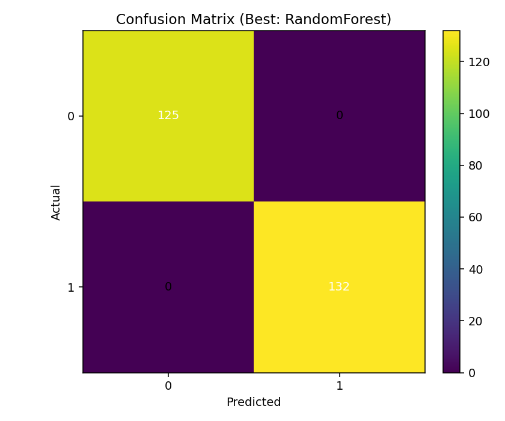

CardioTrack – Local ML Pipeline (Train → Evaluate → Predict → Cardio Report)

A plug-and-play, Windows-friendly workflow for heart-risk modeling on your machine using the dataset at:

CSV (input): C:\Users\sagni\Downloads\Cardio Track\archive\heart.csv

Artifacts & outputs: C:\Users\sagni\Downloads\Cardio Track\

This README covers the four scripts you already have:

cardiotrack_train_and_export.py – trains models and exports H5/PKL/YAML/JSON

cardiotrack_accuracy_and_heatmap.py – saves accuracy chart + confusion heatmap

cardiotrack_show_accuracy_and_heatmap.py – shows and saves those plots

cardiotrack_cardio_report.py – makes a human-readable Cardio Report per person

⚠️ Disclaimer: CardioTrack is a wellness/risk indicator. It is not a medical device and does not provide a diagnosis. For symptoms or concerns, consult a qualified clinician.

✨ What you get

Models: Logistic Regression + Random Forest; auto-select the best by AUROC (or accuracy if AUROC not available).

Artifacts:

cardiotrack_model.pkl — joblib pipeline (preprocessing + model)

cardiotrack_model.h5 — HDF5 file that embeds the pickled model + metadata (no TF required)

cardiotrack_config.yaml — run settings & columns

cardiotrack_report.json — dataset shape, class balance, metrics, chosen model

Evaluation:

cardiotrack_accuracy.png (per-model bar chart)

cardiotrack_confusion_heatmap.png (best model)

cardiotrack_metrics.json (scores + labels)

Predictions:

predictions.csv — original rows + predicted, proba_1 (and proba_0)

prediction_summary.json, prediction_metrics.json (if target present)

Cardio Report:

cardiotrack_cardio_report.csv — per-row risk, flags, recommendations

cardiotrack_cardio_report.json — run summary (counts, metrics if target present)

cardiotrack_cardio_report.txt — human-readable snapshot

🧱 Project layout (suggested)
C:\Users\sagni\Downloads\Cardio Track\
├─ archive\
│  └─ heart.csv
├─ cardiotrack_train_and_export.py
├─ cardiotrack_accuracy_and_heatmap.py
├─ cardiotrack_show_accuracy_and_heatmap.py
├─ cardiotrack_cardio_report.py
└─ (outputs will be created here)

⚙️ Requirements

Python 3.9–3.12

Recommended packages:

pandas, numpy, scikit-learn>=1.2 (for OneHotEncoder(sparse_output=False)),

joblib, pyyaml, h5py, matplotlib

Install:

pip install pandas numpy scikit-learn joblib pyyaml h5py matplotlib

If you have scikit-learn < 1.2: change OneHotEncoder(sparse_output=False) to OneHotEncoder(sparse=False) in the scripts.

🚀 Quickstart (TL;DR)

Open CMD or PowerShell:

# 1) Train & export artifacts
python cardiotrack_train_and_export.py

# 2) Save evaluation plots (no GUI)
python cardiotrack_accuracy_and_heatmap.py

# 3) Show & save plots (opens windows)
python cardiotrack_show_accuracy_and_heatmap.py

# 4) Generate Cardio Report (risk levels, flags, tips)
python cardiotrack_cardio_report.py

All scripts default to your Windows paths. You can override --csv, --out, --input, --model at any time.

🧠 How it works
Target detection

Scripts attempt to find the target column among common names:

target, HeartDisease, heart_disease, label, diagnosis, output, ...

If none match, they’ll heuristically use a low-cardinality last column.

Preprocessing

Numeric: median imputation → StandardScaler

Categorical: most-frequent imputation → One-hot encoding

ColumnTransformer + Pipeline ensures training and inference use identical transforms.

Model selection

Trains LogisticRegression and RandomForest.

Chooses by AUROC if binary probabilities are available; otherwise by accuracy.

📜 Script by script
1) cardiotrack_train_and_export.py

What it does

Loads archive\heart.csv

Splits train/test (25%), trains both models, selects best

Saves: cardiotrack_model.pkl, .h5, .yaml, .json

Run

python cardiotrack_train_and_export.py ^
  --csv "C:\Users\sagni\Downloads\Cardio Track\archive\heart.csv" ^
  --out "C:\Users\sagni\Downloads\Cardio Track"

Outputs

cardiotrack_model.pkl — load with joblib.load(...)

cardiotrack_model.h5 — HDF5 container with pickled model bytes

cardiotrack_config.yaml — preprocessing columns, model choice

cardiotrack_report.json — metrics, shape, class balance

2) cardiotrack_accuracy_and_heatmap.py (save only)

What it does

Retrains (same logic) and saves:

cardiotrack_accuracy.png

cardiotrack_confusion_heatmap.png

cardiotrack_metrics.json

Run

python cardiotrack_accuracy_and_heatmap.py ^
  --csv "C:\Users\sagni\Downloads\Cardio Track\archive\heart.csv" ^
  --out "C:\Users\sagni\Downloads\Cardio Track"

3) cardiotrack_show_accuracy_and_heatmap.py (show + save)

What it does

Same as (2) but also opens GUI windows for both charts.

Run

python cardiotrack_show_accuracy_and_heatmap.py

4) cardiotrack_cardio_report.py

What it does

Loads the saved pipeline (cardiotrack_model.pkl)

Predicts on archive\heart.csv

Computes risk probability (proba_1), maps to risk levels:

Low < 0.50

Moderate 0.50–0.79

High ≥ 0.80

Adds rule-based flags when UCI-style columns exist:

trestbps≥140 → “High BP”

chol≥240 → “High Cholesterol”

thalach<100 → “Low exercise capacity”

fbs==1, oldpeak≥2, restecg∈{1,2}, ca>0, thal≥6, cp∈{3,4}

Adds simple anomaly flags via per-feature z-scores (|z|≥3)

Outputs CSV/JSON/TXT with counts and top high-risk rows

If a true target is present, also computes accuracy/AUROC + confusion matrix in summary JSON

Run

python cardiotrack_cardio_report.py
# or with options:
python cardiotrack_cardio_report.py ^
  --model  "C:\Users\sagni\Downloads\Cardio Track\cardiotrack_model.pkl" ^
  --input  "C:\Users\sagni\Downloads\Cardio Track\archive\heart.csv" ^
  --outdir "C:\Users\sagni\Downloads\Cardio Track" ^
  --id_col id ^
  --target target

Outputs

cardiotrack_cardio_report.csv — id, predicted, risk_probability, risk_level, flags_count, flags, recommendations, proba_0

cardiotrack_cardio_report.json — run summary + metrics (if target present)

cardiotrack_cardio_report.txt — human-readable snapshot

🔧 Customization
Change risk thresholds

Open cardiotrack_cardio_report.py and edit:

def assign_risk_level(p):
    if p is None: return "Unknown"
    if p >= 0.80: return "High"
    if p >= 0.50: return "Moderate"
    return "Low"

Add/remove clinical flags

Modify rule_based_flags(row) to reflect your column names or criteria.

Plot ROC curve (optional)

If you want ROC plots, add to either accuracy script:

from sklearn.metrics import RocCurveDisplay
# After computing y_prob & y_test:
RocCurveDisplay.from_predictions(y_test, y_prob)
plt.title("ROC Curve (Best Model)")
plt.savefig(os.path.join(out_dir, "cardiotrack_roc.png"))
plt.show()  # or omit for headless

🧪 Repro tips

Windows paths: In Python strings, prefer raw strings:
r"C:\Users\sagni\Downloads\Cardio Track\archive\heart.csv"
to avoid unicodeescape errors.

Notebook args: Scripts use parse_known_args() so Jupyter’s -f flag won’t crash them.

Version note: If you hit TypeError: __init__() got an unexpected keyword argument 'sparse_output', use OneHotEncoder(sparse=False) or upgrade scikit-learn.

🛡️ Privacy & Safety

Keep raw data and exports on your local machine unless you intend to share them.

If you later productize, review data protection laws (e.g., India’s DPDP Act) and medical software standards.
Author
SAGNIK PATRA
